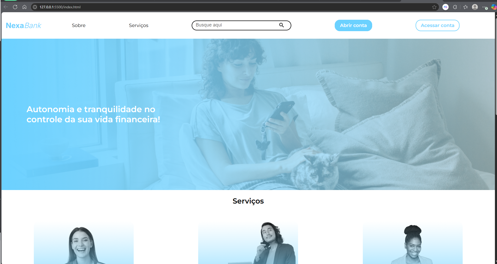

  

  👉 <a href="https://janamirelly.github.io/Projeto-Nexabank/" target="_blank">
    Clique na imagem para ver o projeto no navegador
  </a>

# 💳 NexaBank

**NexaBank** é um projeto de site para um banco digital fictício, com foco em acessibilidade, experiência do usuário e apresentação dos serviços oferecidos. Desenvolvido como exercício prático de front-end, o projeto utiliza **HTML**, **CSS** e **JavaScript** para estruturar e validar formulários, estilizar componentes e organizar o conteúdo de forma clara e responsiva.

---

## 🚀 Funcionalidades

- Página inicial com navegação clara
- Seção de serviços com ícones e imagens
- Destaques de benefícios exclusivos
- Integração com formulário para abertura de conta
- Validação de campos obrigatórios com JavaScript
- Armazenamento temporário dos dados no `localStorage`
- Design responsivo com Flexbox

---

## 🛠️ Tecnologias utilizadas

  
  
  

---

## 📁 Estrutura de Pastas

nexa-bank/
├── index.html
├── script/
│ ├── script.js
│ ├── valida-cpf.js
│ ├── valida-idade.js
├── styles/
│ ├── styles.css
│ └── pagina-inicial/
│ └── styles.css
├── pages/
│ └── abrir-conta-form.html
├── img/
│ └── [imagens do site]
└── README.md

---

## 📋 Como rodar o projeto

1. Clone este repositório:

git clone https://github.com/janamirelly/Projeto-Nexabank.git

---

🎯 Objetivo
Este projeto foi desenvolvido como prática de front-end para exercitar conceitos de HTML semântico, CSS responsivo com Flexbox e validação de formulários com JavaScript. Ele simula a página principal de um banco digital moderno e responsivo.

🙋‍♀️ Desenvolvido em aula por
Janayna Mirelly
Estudante de Análise e Desenvolvimento de Sistemas | Foco em Front-End

📌 Observações
Este é um projeto educacional.

As informações e imagens são fictícias.

